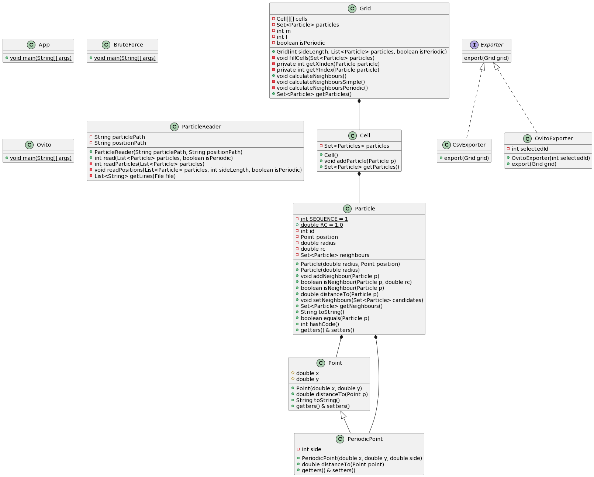

# SS TP1: Búsqueda Eficiente de Partículas Vecinas

Implementación Trabajo Práctico Número 1 para la materia 72.25 - Simulación de Sistemas - Segundo Cuatrimestre 2022.

# Autores

* [Julián Francisco **Arce Doncella**](https://github.com/JuArce)
* [Roberto José **Catalán**](https://github.com/rcatalan98)
* [Gian Luca **Pecile**](https://github.com/glpecile)

# UML

A continuación se detalla el diagrama UML de la arquitectura propuesta:



# Gráficos

El link al gráfico realizado para el punto 2 se encuentra en el siguiente [link](https://public.flourish.studio/visualisation/10893928/).

<div class="flourish-embed flourish-chart" data-src="visualisation/10893928"><script src="https://public.flourish.studio/resources/embed.js"></script></div>

# Dependencias

* Java 17

# Ejecución

## Periodic

Ingresar los parámetros:
```shell
src/main/resources/Static100.txt src/main/resources/Dynamic100.txt false
```

## Brute Force

Ingresar los parámetros:
```shell
src/main/resources/Static100.txt src/main/resources/Dynamic100.txt false
```

## Ovito

Ingresar los parámetros:
```shell
src/main/resources/Static100.txt src/main/resources/Dynamic100.txt src/main/output/outputPeriodic.csv 29 outputOvito.csv 
```